# Detailed Response to the Associate Editor and Reviewers

**Manuscript ID:** T-ASE-2026-1193  
**Manuscript title:** *Trust-Aware Multi-Agent Reinforcement Learning-Based Cooperative Interception Strategy for Maneuvering Swarms with Target Assignment*

Dear Associate Editor and Reviewers,

We sincerely thank you for the careful evaluation of our manuscript and for the constructive comments. We have substantially revised the manuscript to improve its clarity, mathematical consistency, reproducibility, experimental completeness, and practical relevance. All additions and replacements are marked in blue in the highlighted manuscript. The principal revisions include:

1. adding a concise notation table and two complete algorithm boxes;
2. adding physical explanations around the major mathematical formulations in Sections III and IV;
3. correcting the trust-evolution interpretation and clarifying the scope of the convergence and equilibrium claims;
4. revising the contribution statement so that reward shaping and dual-clip/adaptive-KL optimization are treated as task-adapted components rather than standalone inventions;
5. correcting the episode horizon and replacing the ambiguous geometric parameters with the actual three-dimensional initialization ranges;
6. adding an IDBO coefficient-schedule study, a bounded-delay/packet-dropout communication study, and an explicit assignment-to-guidance interface;
7. replacing the previous interception figures with complete three-dimensional results for ART-MAPPO and PN in both maneuver cases, including horizontal and 3-D trajectories, range, three-axis commands, speed, yaw, pitch, time-to-go, time-to-go error, and terminal synchronization;
8. retaining the 1,000-trial Monte Carlo comparisons and adding hardware-in-the-loop channel diagnostics, recurrent-state diagnostics, and explicit failure-case reporting; and
9. expanding the conclusion to state the remaining limitations and future validation directions.

The detailed point-by-point responses are provided below.

## Response to the Associate Editor

| Item | Editor's concern | Response | Detailed changes in the revised manuscript |
|---|---|---|---|
| AE-1 | The manuscript is mathematically dense, uses cumbersome notation, and contains overloaded figures. The editor also highlighted logical inconsistencies, a simplistic environment, parameter mismatches, insufficient ablation/convergence evidence, and limited testing under realistic constraints. | We appreciate this accurate summary and have treated it as the organizing principle of the revision. Rather than making isolated wording changes, we revised the mathematical exposition, algorithm presentation, simulation setup, experimental evidence, and limitation statements together. | **Readability:** Appendix Table VI now summarizes the main symbols; Algorithms 1 and 2 give executable IDBO and ART-MAPPO workflows; intuitive explanations were added before and after the principal equations. **Consistency:** Section IV-B now derives the trust increment explicitly and removes the incorrect monotonic-growth interpretation. Section V-A corrects the horizon to 1,500 steps (75 s) and gives the actual 3-D initial ranges. **Validation:** Fig. 9 adds the IDBO schedule and communication-delay audit; Figs. 12–23 replace the earlier partial plots with complete 3-D ART-MAPPO/PN results; Fig. 24 retains the 1,000-trial Monte Carlo evidence; Table V adds delay, noise, packet-loss, recurrent-state, and failure diagnostics. **Scope:** Sections III-C and V-C distinguish local/empirical convergence from global-optimality or global-equilibrium guarantees. |

## Response to Reviewer 1

We thank Reviewer 1 for recognizing the system-level contribution of coupling distributed target assignment with cooperative guidance, and for the specific suggestions concerning readability and reproducibility.

| No. | Reviewer comment | Response to the reviewer | What was changed in the manuscript |
|---|---|---|---|
| R1-1 | Provide a concise notation table summarizing the key variables and symbols. | We agree. The original manuscript introduced symbols across the assignment, guidance, trust, PPO, and evaluation subsections without a single reference point. We have therefore added a compact notation appendix that consolidates the variables most frequently used by readers. | A new **Appendix, “Notation Table,”** and **Table VI, “Concise Notation Summary,”** were added on page 26. The table includes the interceptor/target sets, assignment matrix, interception probabilities, adversarial advantage, capacity bound, local preference and fitness, consensus winner/bid variables, 3-D position and velocity, yaw and pitch angles, three-axis command vector, time-to-go variables, attention projections, GRU state, actor/critic quantities, trust parameters, PPO ratio, clipping parameters, and the main evaluation metrics. |
| R1-2 | Include pseudocode or algorithm boxes for IDBO and ART-MAPPO to improve reproducibility. | We agree and have added complete procedural descriptions for both stages. These boxes make the input-output relationship, stopping rule, training loop, and deployment path explicit. | **Algorithm 1 (page 6)** now lists IDBO initialization, fitness evaluation, rolling/dancing/breeding/stealing updates, preference thresholding, bid generation, neighbor exchange, top-capacity winner retention, adversarial-advantage update, disagreement evaluation, and termination. **Algorithm 2 (page 11)** now lists ART-MAPPO observation construction, attention-residual and GRU encoding, trust-blended action sampling, feasible-action clipping, transition storage, trust update, GAE computation, dual-clip/adaptive-KL optimization, and decentralized deployment. |
| R1-3 | Add intuitive explanations around the major equations, especially in Sections III and IV. | We agree. The revised manuscript now explains what each mathematical block is intended to do before presenting the equations and explains the physical meaning afterward. | In **Section III-A**, the interception-probability terms are explained as ZEM feasibility and heading advantage, and the product-form objective is interpreted as target survival probability. In **Section III-B**, the three IDBO fitness terms, the four operators, thresholding, bid formation, and top-capacity consensus are described in tactical language. In **Section IV-A**, attention is tied to cross-coupled LOS/time-to-go features, residual blocks to feature preservation, and GRU to temporal engagement history. In **Sections IV-B–IV-D**, the trust target, dual clipping, adaptive KL, the 17-dimensional observation, and the five reward components are each accompanied by physical interpretations. |
| R1-4 | Expand the discussion of real-world applicability, including communication delays, sensing uncertainty, and three-dimensional dynamics. | We agree and substantially extended the validation. The revised work now separates nominal 3-D simulation, communication/HIL diagnostics, and the remaining deployment limitations. | **Three-dimensional dynamics:** Section II-A explicitly defines the 3-D point-mass model and the independent axial, yaw-plane, and pitch-plane commands. Section V-D and **Figs. 12–23** show full 3-D results for both algorithms and both target maneuvers. **Communication and sensing:** Section V-F applies 100-ms observation delay, 50-ms action delay, normalized observation/action noise of 0.003/0.02, and 1% command dropout to five HIL policy endpoints. An additional 3-D perturbation test uses 50-ms sensing delay, 3-m position noise, 0.3-m/s velocity noise, and 0.30-s command lag. **Practical scope:** the conclusion identifies wider bandwidth/delay sweeps, heterogeneous vehicles, held-out maneuvers, and outdoor flight testing as future work. |
| R1-5 | Discuss sensitivity of the reward function with respect to weights and hyperparameters. | We agree. A dedicated subsection now explains how every reward coefficient and the main PPO hyperparameters affect the tradeoff among approach speed, alignment, terminal success, synchronization, control effort, exploration, and policy-update stability. We deliberately present this as a sensitivity and tuning discussion rather than claiming a universal optimal setting. | A new **Section IV-E, “Sensitivity of Reward Weights and Hyperparameters” (page 9),** discusses the roles and failure modes of `w_1`–`w_5`, `\alpha_d`, `\alpha_a`, `\alpha_c`, `\alpha_e`, `R_{\rm hit}`, PPO clip `\epsilon`, dual-clip `c`, target KL threshold `\delta_{\rm targ}`, adaptive KL coefficient, GAE `\lambda_{\rm GAE}`, and entropy coefficient `c_e`. The subsection also states the adopted tuning order: normalize reward components, tune synchronization/control weights around the mission constraints, and then tune PPO/KL parameters using stable reward and critic-loss behavior. |
| R1-6 | Provide a rigorous discussion of the convergence claims and equilibrium properties. | We agree and have narrowed the claims. For IDBO, we provide conditional local-search and consensus arguments under a fixed engagement snapshot, finite feasible assignments, elitist acceptance, connected communication, and bounded delay. For ART-MAPPO, we explicitly state that the evidence is empirical training convergence in a nonconvex MARL problem, not a proof of global optimality or a global Nash equilibrium. | A new **Section III-C, “Discussion on Convergence and Equilibrium Properties” (page 6),** introduces the accepted-fitness sequence in Eq. (43), explains finite winner-list propagation under bounded delay, defines the unilateral-deviation diagnostic in Eq. (44), and explicitly states that consensus alone does not guarantee global optimality or Nash equilibrium. **Section V-C** likewise states that PPO clipping and adaptive KL regularize updates but do not provide a global convergence theorem; the five-seed learning curves in Fig. 11 are used only as empirical evidence. |

## Response to Reviewer 2

| No. | Reviewer comment | Response to the reviewer | What was changed in the manuscript |
|---|---|---|---|
| R2-1 | Consensus reward shaping is common, and dual clipping/adaptive KL should not be packaged as a core innovation for solving overload saturation. | We agree with the distinction. The revised contribution statement emphasizes the system-level coupling of assignment and cooperative guidance and the task-specific integration of the architecture. Reward shaping and dual-clip/adaptive-KL optimization are now identified as established components adapted to this interception problem. We also clarify that actuator limits are imposed by the feasible action envelope and control penalties, whereas dual clipping and KL regularization act on training updates. | The **third contribution in the Introduction** was rewritten: it now describes a task-oriented reward design and training-stabilization strategy and explicitly states that reward shaping and dual-clip PPO are not claimed as standalone methodological novelties. **Section IV-C** now explains that dual clipping lower-bounds the negative-advantage surrogate contribution rather than imposing a hard bound on every realized probability ratio. The deployment paragraph further separates training-only PPO/KL operations from online command generation. |
| R2-2 | The left side of Fig. 5 is unclear; `h^{(0)}` appears repeatedly and the flow from `h^{(l)}` to `h^{(l+1)}` is ambiguous. | We agree and redrew the ART-MAPPO workflow. The revised figure separates decentralized observations, the shared representation backbone, centralized critic/loss path, decentralized actor/exploration path, and training gradients. The representation flow is now shown as one consistent encoder–attention–residual–temporal sequence. | **Fig. 5 (page 10)** was replaced with a clearer full-width diagram. It gives a single encoder definition of `h^{(0)}`, labels the kinematics-aware attention block, explicitly shows the residual identity shortcut from `h^{(l)}` to `h^{(l+1)}`, and then connects `h^{(L+1)}` to temporal integration and GRU state `c_t`. It also visually distinguishes training-only critic/loss components from the decentralized execution path. The revised figure is reproduced below in the figure-evidence section. |
| R2-3 | Section IV-B contains a logical contradiction: the text claims monotonic trust increase, whereas Eq. (42) is a convergent smoothing process. | We agree. This was a genuine inconsistency in the original explanation. We corrected the interpretation by deriving the exact increment and showing that trust can increase or decrease depending on the relation between the current trust and the instantaneous performance-dependent target. | In **Section IV-B (page 7)**, the new increment equation is `\mathcal T_i^{(k+1)}-\mathcal T_i^{(k)}=\alpha_T[\sigma(\tau_T\widetilde R_i^{(k)})-\mathcal T_i^{(k)}]`. The text now states that above-average performance raises the target but does not force monotonic growth; degraded recent performance can reduce trust. For fixed normalized return, the update is identified as a contraction with factor `1-\alpha_T`. |
| R2-4 | The environment is too simple to support the claimed “high-fidelity simulation.” | We agree that the fidelity level must be described precisely. The revised manuscript no longer relies on the phrase “high-fidelity simulation.” Instead, it specifies exactly which 3-D kinematics, constraints, target maneuvers, delays, noise, and communication effects are represented, and it separates these mathematical simulations from the hardware-connected HIL campaign. | **Sections II-A and V-A** now define the 3-D point-mass dynamics, axial/yaw-normal/pitch-normal commands, speed/load limits, 0.05-s step, hit criterion, synchronization criterion, initial positions, altitudes, speeds, and two maneuver families. **Figs. 12–23** provide the complete 3-D state/control evidence. **Section V-F and Table V** separately report the HIL channel configuration and its different 12-m/3-s criteria. Remaining aerodynamic, network-scale, and outdoor-flight extensions are identified in the conclusion. |
| R2-5 | A 25-step episode at 0.05 s is physically impossible for a 1,500-m engagement; `D_1`, `D_2`, and `D_3` are inconsistent with Fig. 6. | We agree and audited the executed scenario configuration. The 25-step statement was incorrect and has been replaced by the actual episode horizon. We also removed the ambiguous `D_1/D_2/D_3` description and report the executed radial, altitude, and speed ranges directly. | **Section V-A (page 11)** now states a maximum horizon of **1,500 steps = 75 s** at `\Delta t=0.05` s. The final selected engagements terminate after approximately 30–37 s, which is physically consistent with the initial range and speed limits. The revised text and **Table II (page 12)** give defender radius 52.63–65.44 m at 0-m altitude, attacker radius 1,987.72–2,145.95 m at 120-m altitude, defender speed 20.32–30.02 m/s, and attacker speed 30.23–45.87 m/s. **Fig. 6** is explicitly described as a horizontal projection rather than the complete 3-D geometry. |
| R2-6 | There is no end-to-end verification of task assignment plus cooperative guidance, and no ablation study. | We agree that the interface between the two stages must be traceable. The revision now records the consensus assignment and uses the same mapping in the 3-D guidance cases. We also add targeted diagnostic studies for the IDBO schedule, communication dissemination, and GRU temporal state. We avoid treating a baseline comparison as a complete factorial ablation of every ART-MAPPO component. | **Fig. 10 and Section V-B (page 12)** show the assignment topology and report the exported one-based assignment vector `[1,2,3,4,5,6,7,8,1,2,3,4,5,6,7,8,1,2,3,4]`. The manuscript states that the same vector is stored in the 3-D case preset and consumed by ART-MAPPO without remapping. **Fig. 9(a)** provides a 30-paired-seed adaptive-versus-fixed IDBO schedule study; **Fig. 9(b)** gives a delay/dropout dissemination study; **Table V** includes an identical-seed GRU-reset diagnostic. **Figs. 12–23 and Table IV** then document the resulting four assignment-to-guidance engagements. |

## Response to Reviewer 3

| No. | Reviewer comment | Response to the reviewer | What was changed in the manuscript |
|---|---|---|---|
| R3-1 | Explain how adaptive rolling, dancing, breeding, and stealing coefficients affect IDBO convergence stability. | We agree. The revision now gives both an intuitive operator-level interpretation and a paired-seed numerical audit of the adaptive schedule. Importantly, the result is reported without overstatement: the adaptive schedule enters its own final 1% band slightly earlier, but does not improve the final objective in the tested configuration. | **Section III-B** explains that rolling performs local exploitation, dancing injects perturbations, breeding attracts candidates to elite preferences, and stealing transfers useful preferences among competitors. The coefficients `\alpha,\beta,\gamma,\delta,\delta',\eta` are identified as iteration-dependent quantities. **Fig. 9(a)** compares a decaying mutation strength 0.36→0.04 with a fixed value 0.18 over 30 paired seeds, population 40, and 100 iterations. The reported final costs are `0.006975\pm0.000141` and `0.006942\pm0.000083`, with median final-band entry iterations 19.0 and 21.5. |
| R3-2 | Add rigorous IDBO complexity and scalability analysis under communication delays. | We agree and added analytical complexity together with a communication-level experiment. The analytical statement is per UAV and separates optimization, communication, and advantage-update costs. The experiment measures timestamped record dissemination rather than incorrectly substituting communication rounds for optimizer convergence. | **Equation (45) in Section III-C** gives `C_{\rm total}=O(TPN^2)+O(N|\mathcal N_i|)+O(N)`, with communication `O(N|\mathcal N_i|)` and memory `O(PN+N)` per UAV. The bounded-delay discussion relates record propagation to graph diameter and maximum link delay. **Fig. 9(b)** tests a 20-node graph with 1% packet dropout: mean dissemination rounds are 4.00, 5.80, 7.07, and 9.17 for maximum delays of 0, 1, 2, and 4 rounds. After removing one node, the connected 19-node subgraph disseminates all remaining records in `7.17\pm0.46` rounds. |
| R3-3 | Add ablations for trust awareness, GRU temporal encoding, and the attention-residual backbone. | We agree that component-level claims require controlled evidence. The revision adds a direct identical-seed GRU-reset diagnostic and retains the standard-MAPPO comparison as evidence for the complete ART-MAPPO package. The trust and attention-residual mechanisms are explained mathematically and supported by training entropy/critic diagnostics, but we do not present those joint diagnostics as a full factorial isolation of every module. | **Table V (page 25)** adds “full history” versus “GRU reset” runs. In Case 2, GRU-reset episode 7 retains all individual hits but synchronizes only 7/8 groups, with a 39.55-s worst spread, directly demonstrating the relevance of temporal state in that case. **Fig. 11** compares ART-MAPPO with IQL, MAPPO, IPPO, and IA2C across five seeds and reports reward, critic loss, and entropy. The text was revised to distinguish complete-method comparisons from strict single-module causal conclusions. A larger factorial ablation across trust and attention/residual variants remains an appropriate extension. |
| R3-4 | Compare ART-MAPPO and conventional MAPPO theoretically in terms of convergence guarantees, exploration–exploitation, and robustness. | We agree and now make the theoretical scope explicit. Both methods use nonconvex neural policy optimization in a partially observed multi-agent setting; therefore, neither is claimed to have a general global-optimality or Nash-equilibrium guarantee. ART-MAPPO changes the representation, temporal memory, exploration mixture, and update regularization, but these additions should be interpreted as mechanisms for empirical stability rather than a stronger global theorem. | **Sections IV-A–IV-C** now explain the representation and exploration differences in detail. **Section IV-C** clarifies the exact dual-clip behavior and adaptive-KL feedback. **Section V-C** explicitly states that dual clipping and KL reduce destructive policy oscillations but do not establish global convergence. **Fig. 11** reports five-seed empirical convergence, critic-loss, and entropy evidence and is described as empirical rather than theoretical convergence. |
| R3-5 | Add sensitivity analysis for the block-probability weights and reward coefficients. | We agree. The revision addresses the two coefficient groups separately because changing assignment-probability weights changes the objective itself, whereas changing reward weights changes learning tradeoffs. | In **Section V-B**, `w_{\rm ZEM}\in\{0.3,0.5,0.7\}` with `w_\sigma=1-w_{\rm ZEM}` gives optimized objective means 0.004611, 0.006986, and 0.009956. The manuscript explicitly interprets these as different ZEM-versus-angular priorities, not as directly ranked performance values on one invariant objective. **Section IV-E** gives a detailed sensitivity account for all five reward weights and PPO/KL hyperparameters, including under-weighting and over-weighting failure modes and the adopted tuning sequence. |
| R3-6 | Explain whether dual-clip PPO and adaptive KL introduce deployment overhead under onboard latency constraints. | We agree that training cost and deployment cost must be separated. Dual clipping, KL evaluation, coefficient adaptation, critic evaluation, and trust-statistics updates are training operations; they are not additional iterative optimization loops in the online guidance path. | A new paragraph at the end of **Section IV-C (page 9)** states that deterministic deployment evaluates only the attention-residual encoder, the GRU state update, and the actor mean from the local observation. Thus, the dual-clip/adaptive-KL machinery adds training computation but no separate online PPO/KL optimization stage. **Fig. 5** visually separates the centralized training path from the decentralized execution path. Hardware-connected endpoint tests are reported in Section V-F rather than claiming processor-independent zero latency. |
| R3-7 | Extend testing to packet loss, sensor noise, and partial interceptor failures. | We agree and added communication/sensing impairment tests at both assignment and guidance levels. The revision also carefully distinguishes removal of a communication node from complete physical failure of an interceptor. | **Fig. 9(b)** includes 1% packet dropout and removal of one node from the 20-node consensus graph while checking dissemination on the remaining connected subgraph. **Section V-F/Table V** test 100-ms observation delay, 50-ms action delay, normalized observation/action noise 0.003/0.02, and 1% command dropout to five HIL endpoints. A separate 3-D test uses 50-ms sensing delay, 3-m position noise, 0.3-m/s velocity noise, and 0.30-s command lag. Dynamic reassignment after complete vehicle loss is not claimed; it is identified through future work on incomplete information and dynamic reassignment. |
| R3-8 | Include failure-case analysis for unsuccessful interception and delayed cooperation. | We agree. Reporting only successful means can hide serious coordination failures, so the revised manuscript explicitly retains the worst delayed-coordination cases. | In **Table V and the accompanying discussion**, Case-1 channel-impaired episode 6 achieves 20/20 individual hits but only 7/8 synchronized groups, with a 43.65-s worst spread. Case-2 GRU-reset episode 7 likewise reaches all targets but synchronizes only 7/8 groups, with a 39.55-s worst spread. These cases are identified as delayed-coordination failures rather than being averaged away. The separate all-hit and all-sync columns show why individual hit rate alone is insufficient. |
| R3-9 | Discuss generalization to unseen target-maneuver patterns. | We agree that random initial-condition testing within two maneuver families is not identical to testing a held-out maneuver family. The revision therefore reports the scope precisely: representative and Monte Carlo tests cover hybrid-evasion and continuous-weaving cases, while broader maneuver-family transfer remains future work. | **Section V-D** gives complete Case-1 and Case-2 trajectories and controls; **Section V-E/Fig. 24** gives 1,000 independent Monte Carlo trials per case. The **Conclusion** now explicitly lists “held-out maneuver families” as a future direction. We avoid using the two predefined maneuver cases alone as proof of universal maneuver generalization. |
| R3-10 | Add hardware-in-the-loop or semi-physical validation. | We agree and added a hardware-connected HIL campaign while keeping its criteria separate from the nominal simulation. The purpose is to test the policy I/O chain and channel impairments, not to relabel the mathematical simulation as a flight test. | **Section V-F and Table V (pages 24–25)** report ten HIL episodes for each diagnostic setting. Policy inference and flight-control I/O operate through hardware-connected endpoints; target dynamics and engagement orchestration run in real time on the host. The HIL test uses a 12-m hit radius and 3-s synchronization threshold, clearly separated from the 3-m/0.5-s nominal simulation criteria. The lightweight portable code example is explicitly distinguished from the complete hardware-connected experimental source. Outdoor flight validation remains future work. |

## Detailed Inventory of Revised and Added Figures/Tables

| Revised item | Status | Detailed content added or clarified | Related comments |
|---|---|---|---|
| Fig. 4: Distributed consensus-based IDBO flowchart | Clarified | Shows the multi-UAV communication layer, local IDBO update, capacity penalty, thresholding and bid generation, top-`K` consensus, convergence test, and parameter update loop. | R1-2, R1-3, R3-1, R3-2 |
| Fig. 5: ART-MAPPO workflow | Redrawn | Separates decentralized observations, shared attention-residual/GRU backbone, centralized critic/loss path, trust-modulated exploration, structured guidance actions, and decentralized command output. The `h^{(0)}\rightarrow h^{(l)}\rightarrow h^{(l+1)}\rightarrow h^{(L+1)}\rightarrow c_t` flow is explicit. | R2-2, R3-4, R3-6 |
| Fig. 6 and Table II: Environment geometry | Corrected/clarified | Fig. 6 is explicitly identified as a horizontal projection. Table II and the text provide the actual 3-D radius, altitude, speed, heading, and action-bound values. | R1-4, R2-4, R2-5 |
| Fig. 9: IDBO schedule and communication audit | New | Panel (a) gives the 30-paired-seed adaptive-versus-fixed coefficient study; panel (b) gives dissemination rounds under bounded delay, packet dropout, and one-node removal. | R2-6, R3-1, R3-2, R3-7 |
| Fig. 10: Assignment topology | Expanded explanation | Shows the 20-to-8 capacity-feasible assignment and is accompanied by the exact exported assignment vector used by the guidance stage. | R2-6 |
| Fig. 11: Five-seed training curves | Expanded interpretation | Reports normalized reward, critic loss, and policy entropy for ART-MAPPO and four baselines, while the text limits the conclusion to empirical training convergence. | R1-6, R3-3, R3-4 |
| Figs. 12–14: ART-MAPPO, Case 1 | Replaced with complete V10 group | Horizontal/3-D trajectory, range, `n_x`, `n_y`, `n_z`, speed, yaw, pitch, time-to-go, time-to-go error, and terminal synchronization. | R1-4, R2-4, R2-6 |
| Figs. 15–17: PN, Case 1 | Replaced with complete V10 group | Same twelve physical quantities under the capacity-matched PN baseline. | R1-4, R2-4, R2-6 |
| Figs. 18–20: ART-MAPPO, Case 2 | Replaced with complete V10 group | Same twelve quantities for continuous weaving targets, including the longer-duration group. | R1-4, R2-4, R2-6, R3-9 |
| Figs. 21–23: PN, Case 2 | Replaced with complete V10 group | Same twelve quantities for PN under continuous weaving, exposing sustained use of yaw-plane maneuver authority. | R1-4, R2-4, R2-6, R3-9 |
| Table IV: Representative 3-D results | New | Summarizes hits, covered targets, synchronized groups, and maximum arrival spread for all four method–case combinations. | R1-4, R2-6 |
| Fig. 24: Monte Carlo comparison | Retained and clarified | Reports successful-trial distributions for timing, terminal command, miss distance, and engagement time, together with the 1,000-trial success counts. | R3-9 |
| Table V: HIL diagnostics | New | Separates all-hit and all-sync outcomes for full-history, GRU-reset, and channel-impaired tests and retains the two worst delayed-coordination failures. | R1-4, R2-6, R3-3, R3-7, R3-8, R3-10 |
| Table VI: Notation summary | New | Consolidates the main symbols from the assignment, guidance, trust, optimization, and evaluation sections. | R1-1 |

## Figure Evidence Included with the Response

### Revised Fig. 4: IDBO workflow

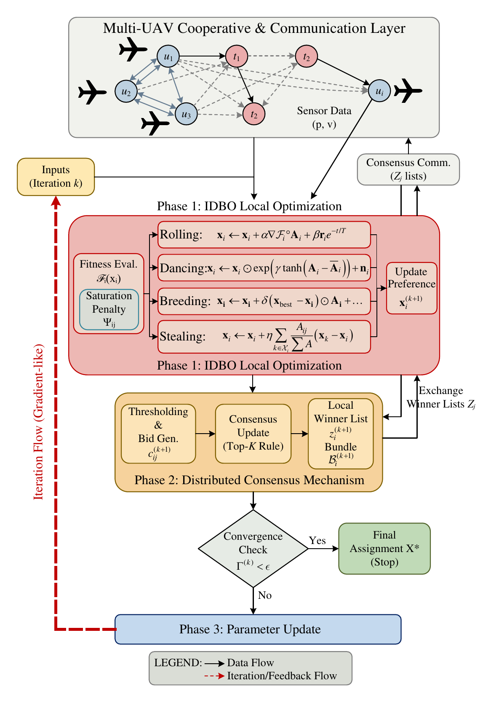

### Revised Fig. 5: ART-MAPPO workflow

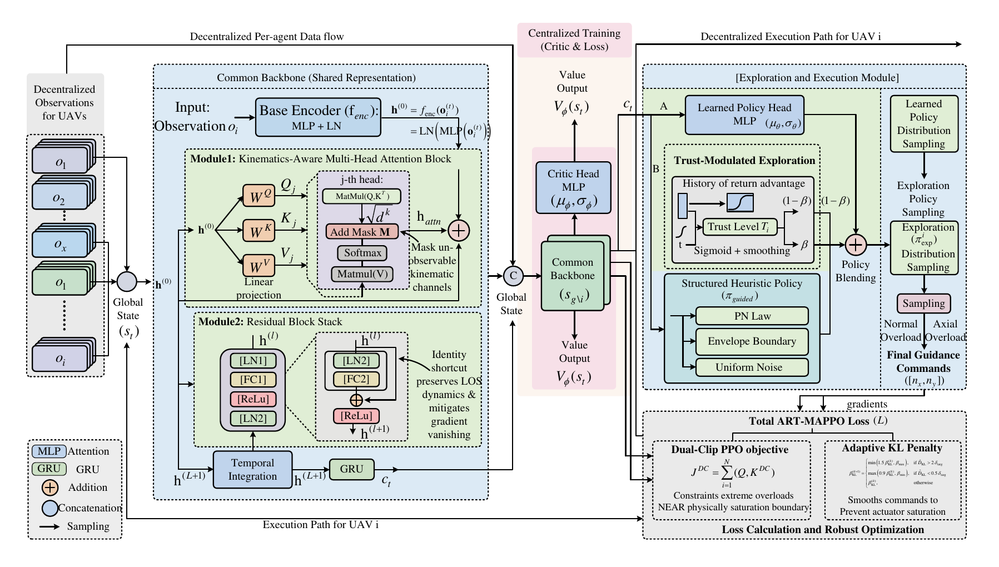

### Clarified Fig. 6: simulation environment projection

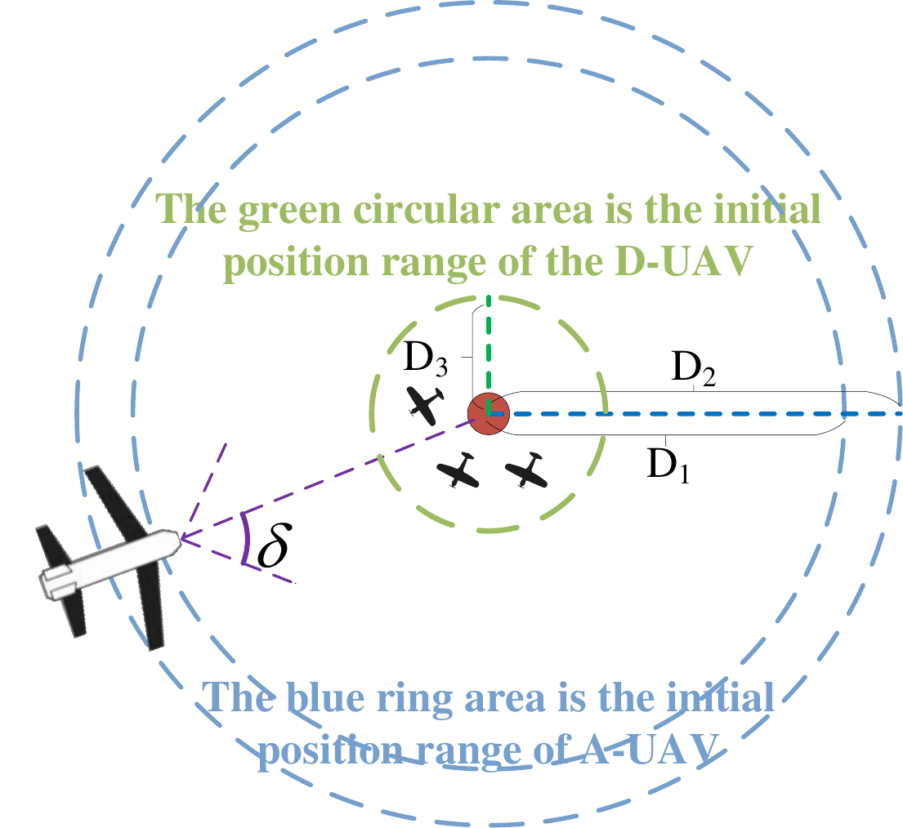

### New Fig. 9: IDBO coefficient-schedule and communication-delay audit

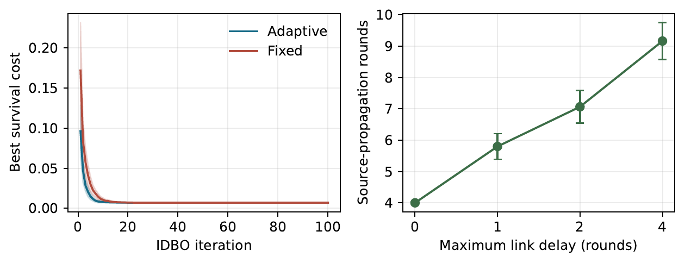

### Fig. 10: assignment topology used by the guidance stage

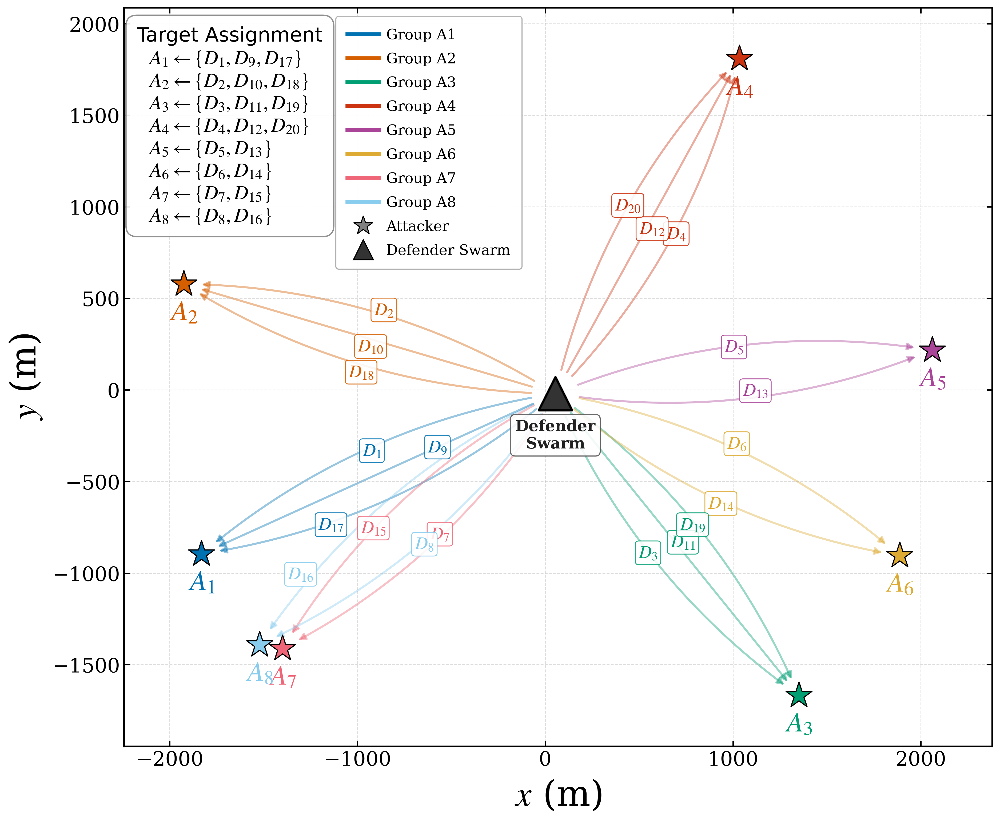

### Fig. 11: five-seed ART-MAPPO and baseline training diagnostics

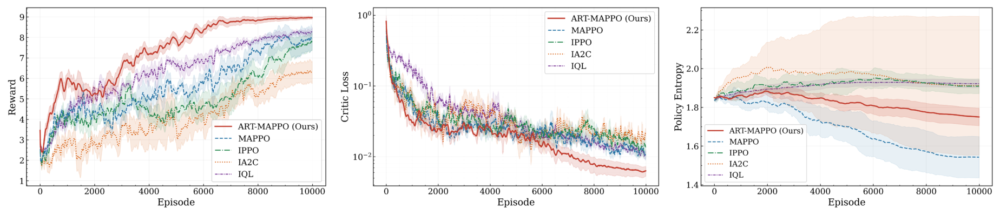

### Figs. 12–14: ART-MAPPO, Case 1

Panel order is: horizontal trajectory, 3-D trajectory, range; `n_x`, `n_y`, `n_z`; speed, yaw, pitch; time-to-go, time-to-go error, and terminal synchronization.

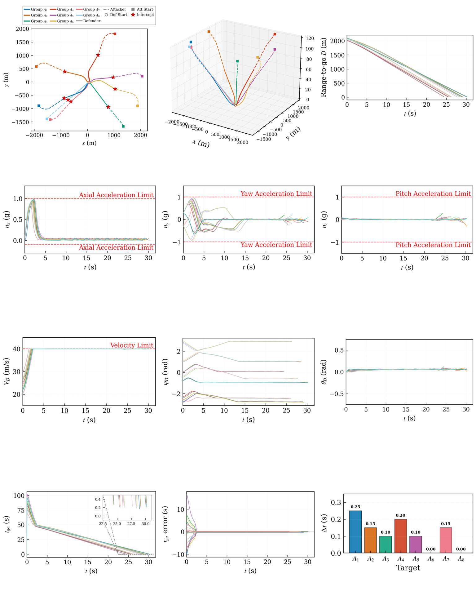

### Figs. 15–17: PN, Case 1

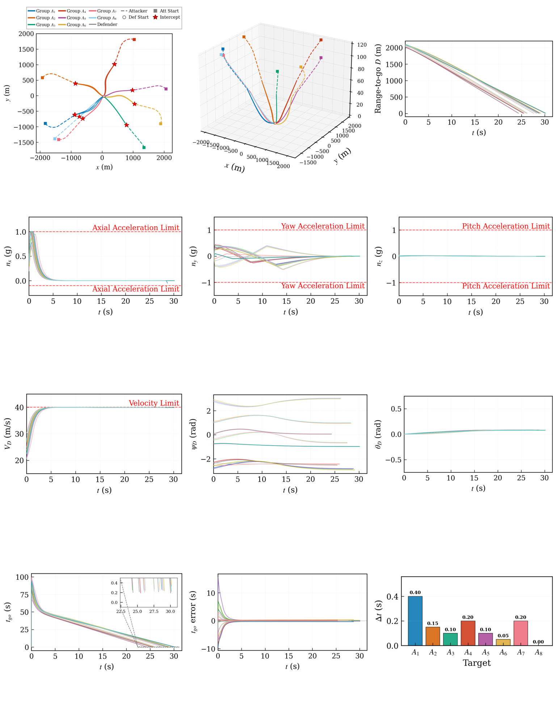

### Figs. 18–20: ART-MAPPO, Case 2

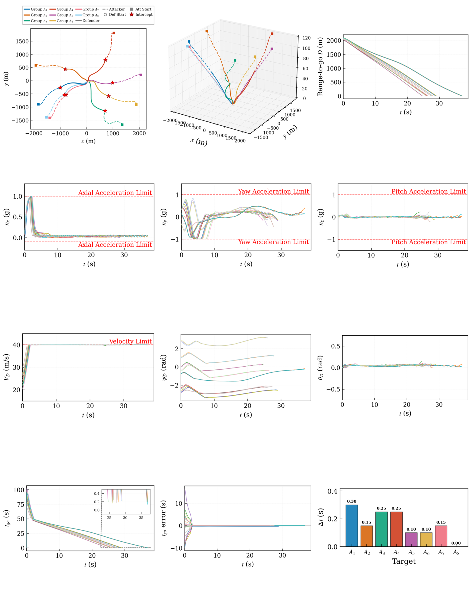

### Figs. 21–23: PN, Case 2

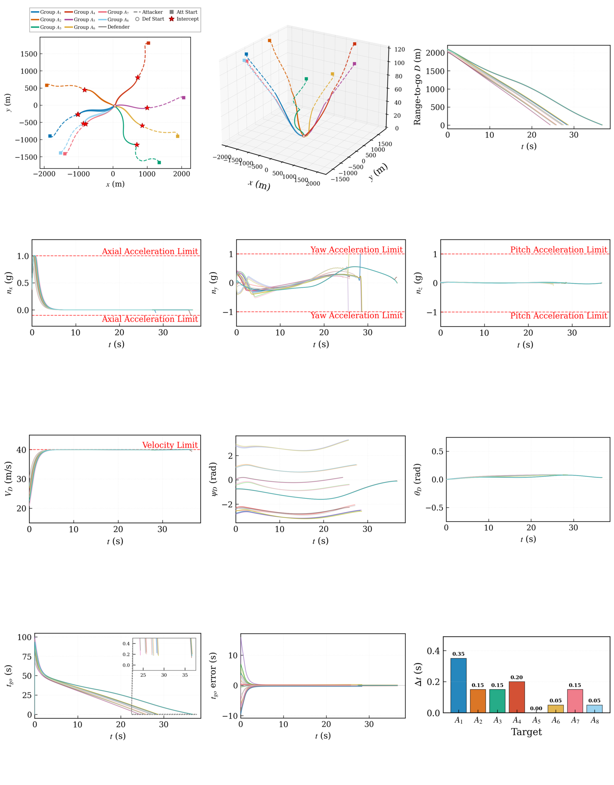

### Fig. 24: 1,000-trial Monte Carlo comparisons

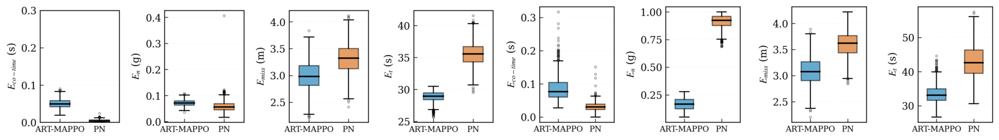

## Closing Statement

We again thank the Associate Editor and all reviewers for their detailed comments. The revision has improved the manuscript in four essential ways: it is easier to reproduce, its mathematical claims are more carefully scoped, its simulation configuration is internally consistent, and its experimental section now presents a complete chain from capacity-constrained assignment to three-dimensional cooperative guidance and hardware-connected channel diagnostics. We hope that the revised manuscript and the detailed responses above satisfactorily address the concerns.

